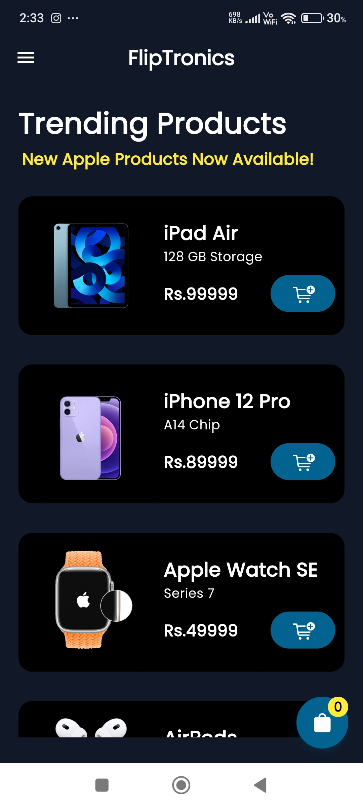
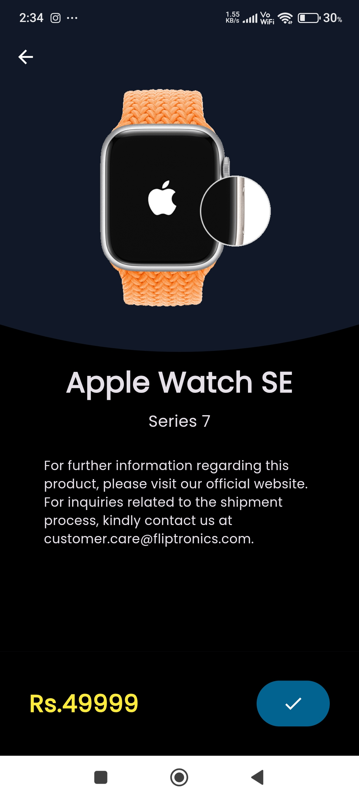
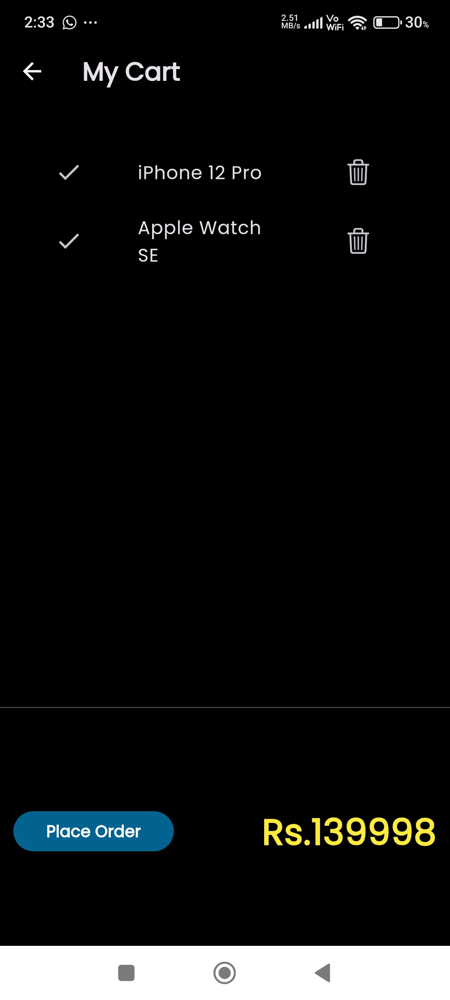
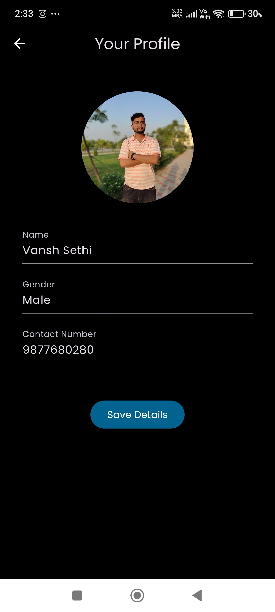
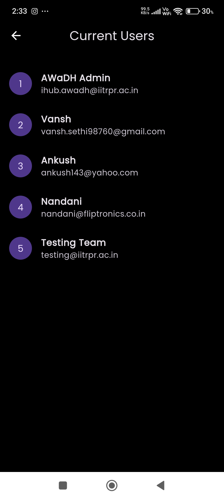

# 📱 Fliptronics : Easy Access To Electronics


An E-commerce mobile and web application built using Flutter and Firebase. Fliptronics offers a seamless shopping experience with features like user authentication, product browsing, cart management, and order placement — all built with performance and scalability in mind.

---

## 🌐 Live Demo

- 🔗 [Web App](https://fliptronics.web.app/)
- 📦 [Download APK](https://drive.google.com/file/d/1Vn66T3rnYDEkQABozTN5pRUpSoR22w2v/view)

---

## Video Demo 


https://github.com/user-attachments/assets/26a3207e-50e0-4169-b921-360e43437264


---

## 📸 Screenshots

<div align="center">

<table>
  <tr>
    <td align="center"><b>Home</b></td>
    <td align="center"><b>Product Details</b></td>
    <td align="center"><b>Cart</b></td>
  </tr>
  <tr>
    <td></td>
    <td></td>
    <td></td>
  </tr>
  <tr>
    <td align="center"><b>Login</b></td>
    <td align="center"><b>Profile</b></td>
    <td align="center"><b>Current Users</b></td>
  </tr>
  <tr>
    <td></td>
    <td></td>
    <td></td>
  </tr>
</table>

</div>

---

## ✨ Features

- 🔐 Firebase Authentication (Sign up, Sign in)
- 📦 Product listing and detail view
- 🛒 Add to cart and cart management
- 💳 Checkout system
- 🔄 Persistent user sessions
- 🌍 Web and mobile compatibility

---

## 🚀 Getting Started

To run this project locally:

### Prerequisites

- Flutter SDK
- Dart
- Android Studio or VS Code
- Firebase Project Setup

### Installation

```bash
git clone https://github.com/vansh-121/Fliptronics.git
cd Fliptronics
flutter pub get
flutter run
